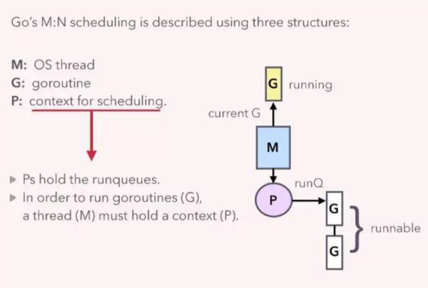

## goroutine

用户级的thread，由go runtime创建和管理，而非OS。go scheduler是一种M:N调度器，OS threads通过shceduler调度N个goroutines。
如下图所示，其中M为os thread，P为调度的上下文，G为goroutine



每个P都对应有自己的一个local的runqueue，P的数量由用户设置的GOMAXPROCS决定。

### 系统调用

go不能控制线程在进入内核态之后的行为。为了保证并发性能，只能在进入系统调用之前从线程池拿一个线程或者新建一个线程，并将P交给新线程。当前线程等待系统调用返回。

返回后，如果能获取到空闲的，则当前线程和goroutine可以继续参与调度。如果没有则当前goroutine放入global runqueue中。

### work steal调度

M在处理完P的local runqueue之后，会尝试从global runqueue中获取goroutine执行，如果没有，则从其他线程对应的P中steal一半的goroutine到自己的P中进行调度。

## channel

channel源码位于runtime/chan.go

channel是一个hchan结构体，故可以在function之间传递。

```
type hchan struct {
	qcount   uint           // 当前buffer中的数据数量
	dataqsiz uint           // buffer的capacity
	buf      unsafe.Pointer // buffer，采用循环队列结构（circular queue）
	elemsize uint16
	closed   uint32
	elemtype *_type // element type
	sendx    uint   // 记录下一次send操作使用buffer的index
	recvx    uint   // 记录下一次receive操作使用buffer的index
	recvq    waitq  // 执行receive的等待队列，采用链表结构
	sendq    waitq  // 执行send的等待队列，采用链表结构

	// lock protects all fields in hchan, as well as several
	// fields in sudogs blocked on this channel.
	//
	// Do not change another G's status while holding this lock
	// (in particular, do not ready a G), as this can deadlock
	// with stack shrinking.
	lock mutex
}
```

### 阻塞机制

以send举例。当hchan.buf满了且hchan.recvq为空时，当前goroutine会被封装到sudog结构中并加入hchan.sendq。
调度器会将当前goroutine置为waiting状态，并调度执行其他goroutine。

当hchan.buf不满的时候，receive操作会pop hchan.sendq队首的sudog，然后使其对应的goroutine恢复为可执行状态。
当调度器再次调度到该goroutine后，恢复执行。

### send源码分析

```
func chansend(c *hchan, ep unsafe.Pointer, block bool, callerpc uintptr) bool {
	...

	lock(&c.lock)

	// 向已经close的channel send数据会引发panic
	if c.closed != 0 {
		unlock(&c.lock)
		panic(plainError("send on closed channel"))
	}

	// 优先向receive阻塞的goroutine send数据
	// 从recvq中pop sudog，如找到，则send数据
	if sg := c.recvq.dequeue(); sg != nil {
		send(c, sg, ep, func() { unlock(&c.lock) }, 3)
		return true
	}

	// 等待队列为空，则将数据加入buffer
	if c.qcount < c.dataqsiz {
		// 根据sendx找到buf中的可用地址
		qp := chanbuf(c, c.sendx)
		if raceenabled {
			raceacquire(qp)
			racerelease(qp)
		}
		typedmemmove(c.elemtype, qp, ep) // 数据写入buffer
		// sendx移到下一个可用位置
		c.sendx++
		if c.sendx == c.dataqsiz {
			c.sendx = 0
		}
		c.qcount++ // 数据个数加一
		unlock(&c.lock)
		return true
	}

	if !block {
		unlock(&c.lock)
		return false
	}

	// 如果buffer已满，则阻塞
	// 创建sudog
	gp := getg()
	mysg := acquireSudog()
	mysg.releasetime = 0
	if t0 != 0 {
		mysg.releasetime = -1
	}
	mysg.elem = ep
	mysg.waitlink = nil
	mysg.g = gp
	mysg.isSelect = false
	mysg.c = c
	gp.waiting = mysg
	gp.param = nil
	// sudog加入sendq
	c.sendq.enqueue(mysg)
	// 阻塞当前goroutine
	goparkunlock(&c.lock, waitReasonChanSend, traceEvGoBlockSend, 3)

	if mysg != gp.waiting {
		throw("G waiting list is corrupted")
	}
	gp.waiting = nil
	if gp.param == nil {
		if c.closed == 0 {
			throw("chansend: spurious wakeup")
		}
		panic(plainError("send on closed channel"))
	}
	gp.param = nil
	if mysg.releasetime > 0 {
		blockevent(mysg.releasetime-t0, 2)
	}
	mysg.c = nil
	releaseSudog(mysg)
	return true
}
```

### receive源码分析

```
func chanrecv(c *hchan, ep unsafe.Pointer, block bool) (selected, received bool) {
	...

	lock(&c.lock)

	// 如果已close且buf为空，则返回false
	if c.closed != 0 && c.qcount == 0 {
		if raceenabled {
			raceacquire(unsafe.Pointer(c))
		}
		unlock(&c.lock)
		if ep != nil {
			typedmemclr(c.elemtype, ep)
		}
		return true, false
	}

	// 从sendq中pop一个sudog
	// 如果存在，则说明buffer已满
	if sg := c.sendq.dequeue(); sg != nil {
		recv(c, sg, ep, func() { unlock(&c.lock) }, 3)
		return true, true
	}

	// buffer未满，且不为空时，读取buffer
	if c.qcount > 0 {
		qp := chanbuf(c, c.recvx)
		if raceenabled {
			raceacquire(qp)
			racerelease(qp)
		}
		if ep != nil {
			typedmemmove(c.elemtype, ep, qp)
		}
		typedmemclr(c.elemtype, qp)
		// recvx指向下一个位置
		c.recvx++
		if c.recvx == c.dataqsiz {
			c.recvx = 0
		}
		c.qcount-- // buffer中数据个数减一
		unlock(&c.lock)
		return true, true
	}

	if !block {
		unlock(&c.lock)
		return false, false
	}

	// 创建sudog
	gp := getg()
	mysg := acquireSudog()
	mysg.releasetime = 0
	if t0 != 0 {
		mysg.releasetime = -1
	}
	mysg.elem = ep
	mysg.waitlink = nil
	gp.waiting = mysg
	mysg.g = gp
	mysg.isSelect = false
	mysg.c = c
	gp.param = nil
	// 将sudog加入到recvq
	c.recvq.enqueue(mysg)
	// 阻塞当前goroutine
	goparkunlock(&c.lock, waitReasonChanReceive, traceEvGoBlockRecv, 3)

	if mysg != gp.waiting {
		throw("G waiting list is corrupted")
	}
	gp.waiting = nil
	if mysg.releasetime > 0 {
		blockevent(mysg.releasetime-t0, 2)
	}
	closed := gp.param == nil
	gp.param = nil
	mysg.c = nil
	releaseSudog(mysg)
	return true, !closed
}

func recv(c *hchan, sg *sudog, ep unsafe.Pointer, unlockf func(), skip int) {
	if c.dataqsiz == 0 {
		// 如果没有buffer，直接接收sender的数据
		if raceenabled {
			racesync(c, sg)
		}
		if ep != nil {
			recvDirect(c.elemtype, sg, ep)
		}
	} else {
		// 如果队列满，copy buffer队首数据给receiver
		qp := chanbuf(c, c.recvx)
		if raceenabled {
			raceacquire(qp)
			racerelease(qp)
			raceacquireg(sg.g, qp)
			racereleaseg(sg.g, qp)
		}
		if ep != nil {
			typedmemmove(c.elemtype, ep, qp)
		}
		// 将sender数据copy到buffer队首
		typedmemmove(c.elemtype, qp, sg.elem)
		// sendx和recvx移到下一个位置
		c.recvx++
		if c.recvx == c.dataqsiz {
			c.recvx = 0
		}
		c.sendx = c.recvx 
	}
	sg.elem = nil
	gp := sg.g
	unlockf()
	gp.param = unsafe.Pointer(sg)
	if sg.releasetime != 0 {
		sg.releasetime = cputicks()
	}
	// goready可以将sender goroutine置为runnable状态，等待调度。
	goready(gp, skip+1)
}
```

### To read

* [something interesting](https://segmentfault.com/a/1190000005055329)

## 参考资料

* https://blog.csdn.net/jiankunking/article/details/79056677
* https://about.sourcegraph.com/go/understanding-channels-kavya-joshi/
* https://blog.csdn.net/kongdefei5000/article/details/75209005