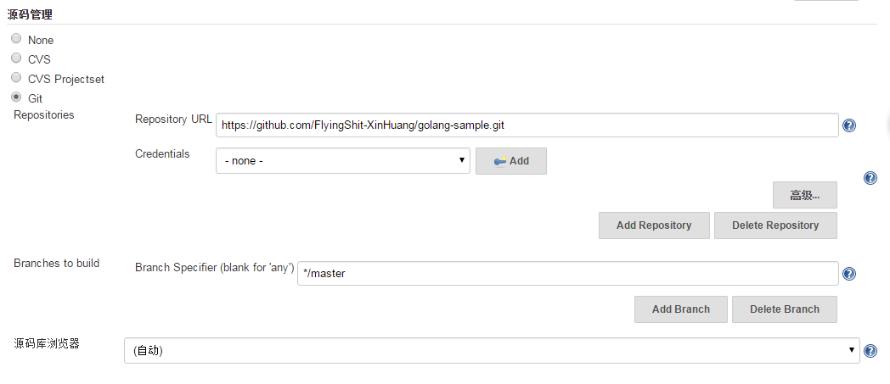
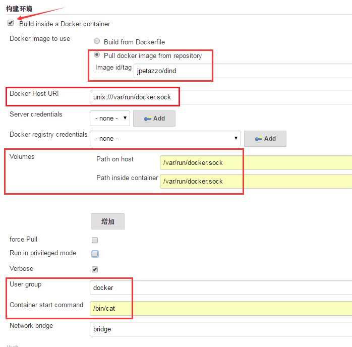
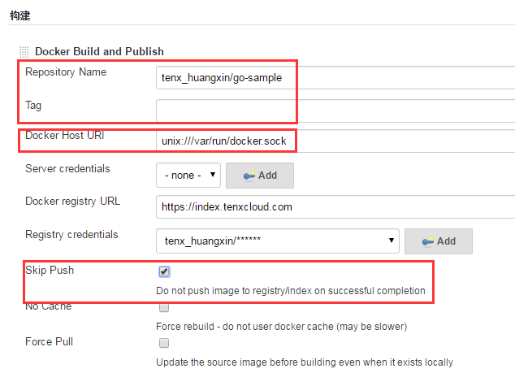
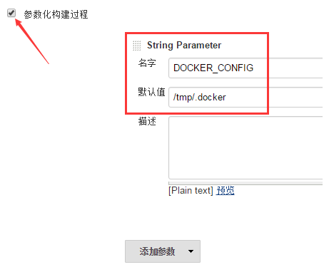

# jenkins docker相关插件

## 相关插件简介

### Docker Plugin

[插件链接](https://wiki.jenkins-ci.org/display/JENKINS/Docker+Plugin)

该插件尚不稳定

用于创建容器化的从节点，并在从节点上执行构建任务，构建结束后从节点随之删除。

### Docker build step plugin 

[插件链接](https://wiki.jenkins-ci.org/display/JENKINS/Docker+build+step+plugin)

插件不可用

用于在Job配置的构建步骤中添加Docker相关指令

### Kubernetes Plugin

[插件链接](https://wiki.jenkins-ci.org/display/JENKINS/Kubernetes+Plugin)

该插件尚不稳定

用于创建多个基于k8s管理的docker容器来动态提供从节点，实现构建并清除slave。

先决条件：

* k8s集群
* slave的docker镜像，推荐为csanchez/jenkins-slave

安装后在“系统设置”中进行配置

### CloudBees Docker Build and Publish plugin

[插件链接](https://wiki.jenkins-ci.org/display/JENKINS/CloudBees+Docker+Build+and+Publish+plugin)

可与CloudBees Docker Custom Build Environment Plugin结合使用，在容器中构建镜像。但目前push镜像出错。

使用给定的Dockerfile构建镜像并推送到registry。

### CloudBees Docker Custom Build Environment Plugin

[插件链接](https://wiki.jenkins-ci.org/display/JENKINS/CloudBees+Docker+Custom+Build+Environment+Plugin)

使用给定镜像或Dockerfile构建一个运行环境，在此环境中执行构建任务。可打印详细日志，便于定位问题。

## 可行方案

经实测，目前可实现构建环境容器化的比较稳定的插件为CloudBees Docker Custom Build Environment Plugin，与CloudBees Docker Build and Publish plugin插件和git相关插件结合可以完成clone/pull > build containerize env > build with Dockerfile的过程（push过程由于CloudBees Docker Build and Publish plugin插件的缺陷尚不能执行）。

可在任意节点构建，构建节点需要安装docker，git和jdk7。

### 原理

测试使用的镜像基于jpetazzo/dind构建，但仅使用了docker client，通过将主机的/var/run/docker.sock挂载到镜像中，从而实现在镜像中使用docker指令。这种方式除了实现docker in docker，另一个好处是可以使用主机的cache来加速镜像构建。

构建时：
1. Jenkins master会选择构建节点。默认只支持“仅可能使用当前节点”和“只执行分配的任务”两种策略。
2. 构建节点使用git拉取代码到workspace下。
3. CloudBees Docker Custom Build Environment Plugin插件在该节点上运行指定镜像（docker run）创建容器，并将Job的workspace挂载到容器中。
4. CloudBees Docker Custom Build Environment Plugin插件访问创建的容器执行构建步骤（docker exec），执行容器时会使用一个随即的用户执行全部构建指令。
5. CloudBees Docker Build and Publish plugin插件使用指定路径中Dockerfile进行构建。
6. 执行完成后，停止并删除容器。

需要注意的是，CloudBees Docker Custom Build Environment Plugin插件运行的docker指令都是在构建节点上执行的，因此会占用一个executor。executor数量可以在节点配置中修改。

### 使用方法

确保已安装插件CloudBees Docker Custom Build Environment Plugin和CloudBees Docker Build and Publish plugin。可以在“系统管理” > “管理插件”中安装和查看插件。此外还要安装Git plugin。

 

在Job配置页面的“源码管理”中配置git相关参数。

 

在“构建环境”中勾选“Build inside a Docker container”，选择“Pull docker image from repository”并输入使用的镜像名称。配置“Docker Host URI”来访问docker engine。配置“Volumes”将docker.sock挂在到镜像中，这样就可以实现镜像中使用主机的docker cache。配置“User group”为docker，以便构建时随机创建的用户可以使用docker指令。“Container start command”根据实际情况进行配置即可。

 

在“构建”中点击“增加构建步骤” > “Docker Build And Publish”。配置“Repository Name”和“Tag”。“Docker Host URI”输入unix:///var/run/docker.sock。确保“Skip Push”为勾选状态。

 

需要注意的是，以上配置在构建时会产生“WARNING: Error loading config file:/root/.docker/config.json - stat /root/.docker/config.json: permission denied”，对CloudBees Docker Build and Publish plugin插件会产生影响。可以通过添加“DOCKER_CONFIG”参数来解决。

 

