# jenkins调研

## 简介

jenkins是一款开源的、用于自动化构建和部署的server：

* 可作为CI和CD的一种解决方案。
* 安装简单。支持多种平台
* 易于配置。通过Web UI完成配置
* 插件丰富。支持数以百计的插件。
* 可扩展。可通过其插件化的架构扩展jenkins。
* 分布式。jenkins可以轻易的将工作分布到多个主机中，更快地完成构建、测试和部署工作，且支持跨平台。

## 安装运行

[ubuntu上安装方法](https://wiki.jenkins-ci.org/display/JENKINS/Installing+Jenkins+on+Ubuntu)
[docker容器中运行方法](https://console.tenxcloud.com/docker-registry/detail?imageName=docker_library/jenkins)

在浏览器中访问localhost:8080端口即可进入Jenkins Web控制台。

## Job

一个Job就是一个构建任务，Jenkins Job拥有强大的功能，包括“代码源管理”、“构建触发管理”、“构建步骤管理”、“构建完成后续操作管理”等。还可以查看构建历史、和构建日志等功能。

### Job创建

Job创建操作非常简单，如下图所示：

 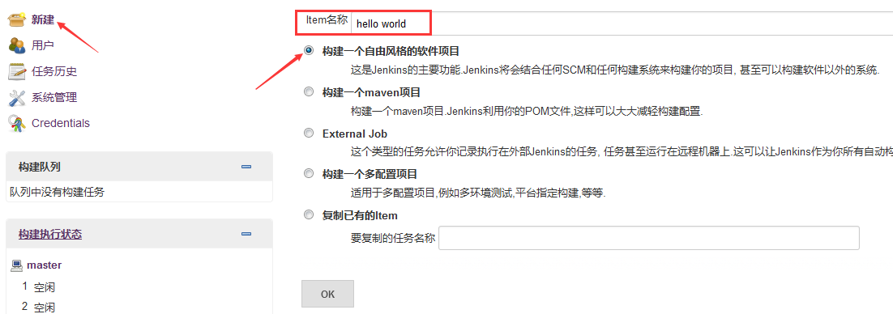

Job创建后，点击“配置”可以对Job进行构建配置。

 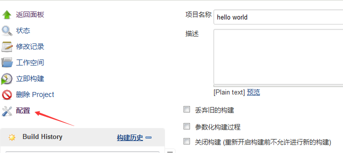

### 一些实用的Job配置

#### 丢弃旧的构建

该配置用来控制磁盘的消耗，通过限制天数和个数限制日志、操作历史、构建包等占用的磁盘大小。

 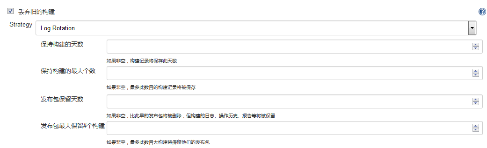

#### 项目依赖构建顺序控制

* Job可以在“构建触发器”中设置该Job依赖的项目，被依赖的项目完成构建时该Job自动触发构建。

 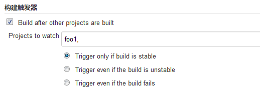

* 也可以在“构建后操作”中设置依赖该Job的项目，该Job完成构建后自动构建依赖该Job的项目。

 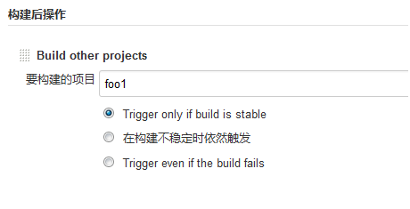

* 在“高级项目选项”中可以设置是否与依赖或被依赖的项目同时构建。

 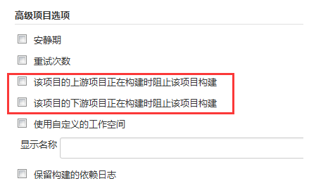

#### 代码源管理

默认支持CVS和SVN，通过插件可以支持Git和HG等管理工具。

 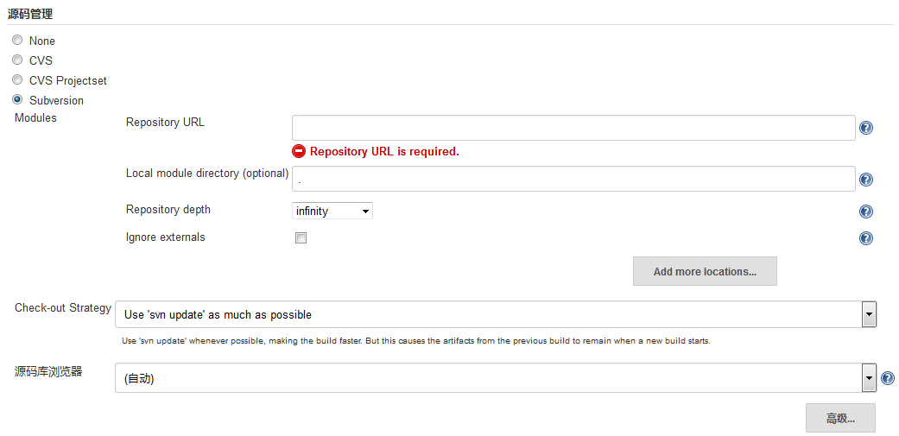

#### 构建触发器

除了之前介绍的依赖其他项目构建的触发条件，Job还支持周期构建和代码拉取构建。

周期性构建类似于设置一个cron定时任务，根据设置的定时规则触发构建。

代码拉取构建与周期性构建类似，但设置的是拉取代码操作的定时策略，如果代码拉取后有更新，则触发构建。

 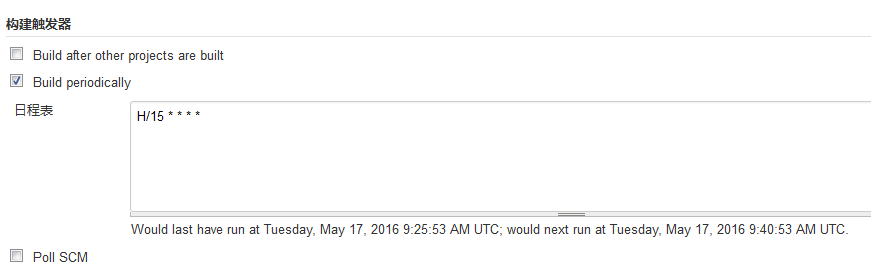

#### 构建步骤

在“构建步骤”中可以定义多个步骤，如执行脚本。
 

#### 构建后操作

在“构建后操作”中可以定义多个Job构建后执行的操作，如构建其他项目、发送邮件通知、发布测试报告、发布文档等。

 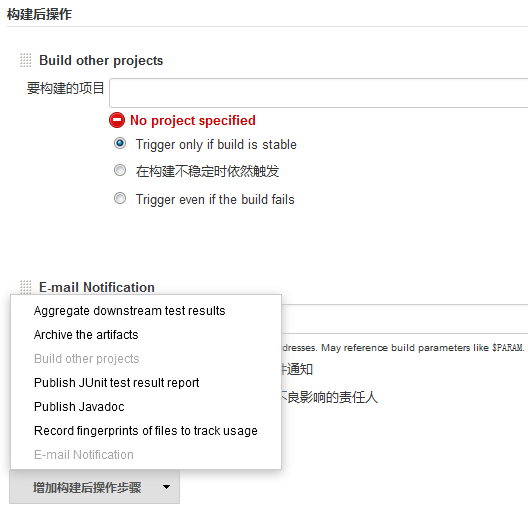

### 构建历史与日志

在Job详情页面可以看到当前Job的构建历史。

 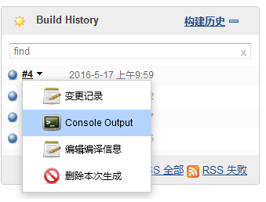

点击某次构建的“Console Output”可以查看本次构建的日志，查看的构建可以是进行中的。

 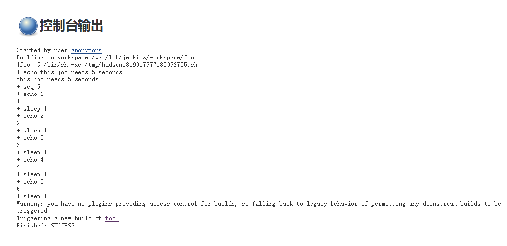

## 节点管理

访问http://YourServer/computer/可以查看当前Jenkins集群中的节点信息，默认只有master节点。

### 创建slave节点

* 点击“新建节点”，勾选“Dumb Slave”并输入节点名称，点击“OK”按钮

 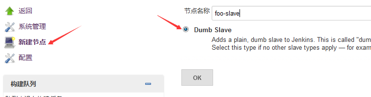

* 在详情页面中输入executors数量，工作目录和启动方法。其他默认即可。其中executors数量表示执行Job的worker数量，工作目录为保存Job构建历史、日志等数据的目录，启动方法选“Launch slave agents via Java Web Start”

 

* 创建后在节点列表页面可以看到创建的从节点，但节点为未启动状态。

 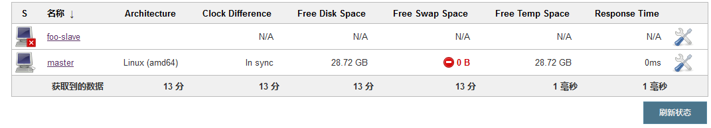

* slave节点需要安装java运行环境，在slave中执行以下指令：

```
# 下载slave.jar，<YourPath>为存放jar包的目录，<MasterHost>为Jenkins Master主机，如127.0.0.1:8080
$ curl -sSfL -o <YourPath>/slave.jar <MasterHost>/jnlpJars/slave.jar
# 启动slave，其中<SlaveName>要与在master中创建的slave名称一致
$ java -jar <YourPath>/slave.jar -jnlpUrl http://<MasterHost>/computer/<SlaveName>/slave-agent.jnlp
```

* 启动后在节点列表页面可以看到之前创建的foo-slave已经就绪，可以用来构建Job了。

 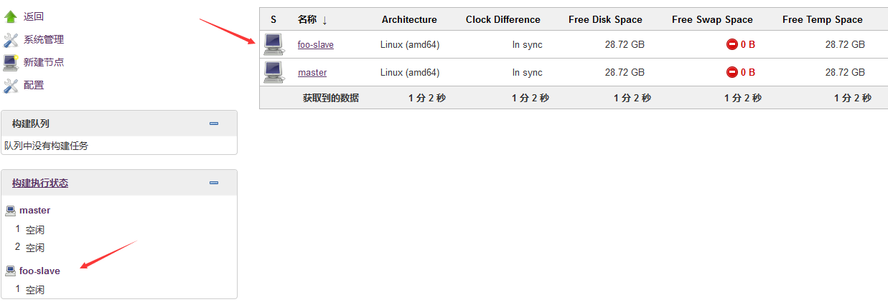

### 负载统计

进入具体的节点的详情页并点击“负载统计”可以查看到当前节点的负载统计图，负载数据可以为是否需要加入节点的决策来提供依据。

 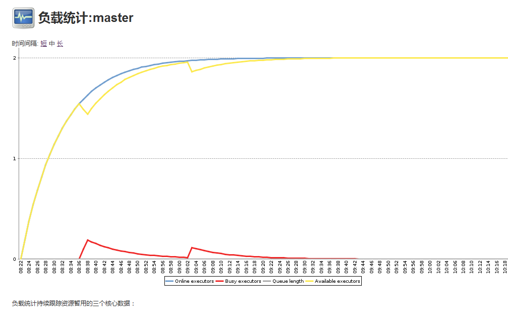

## 集成Jenkins

Jenkins提供了REST API来方便与其他系统集成。在Web控制台每个页面的下方都有“REST API”的链接，点击之后可以查看当前页面相关功能的REST API说明。

 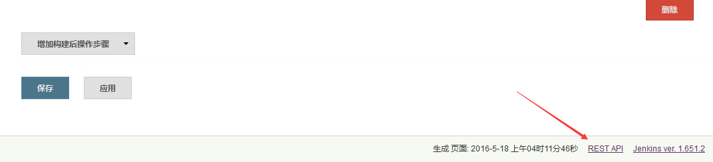

下图是获取和更新Job配置的REST API。

 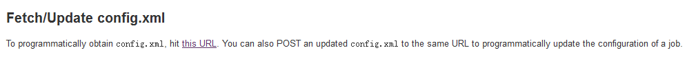