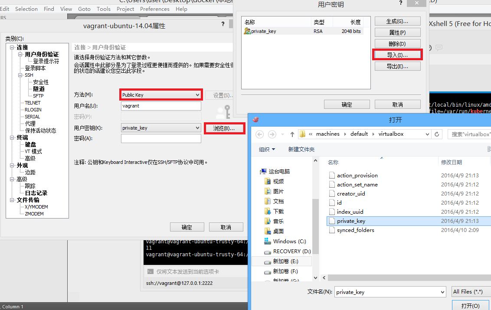

# 环境安装

## 环境说明

* 操作系统：Windows 7 旗舰版

## 下载及安装列表

* [vagrant](https://www.vagrantup.com/downloads.html)

* [virtualbox](https://www.virtualbox.org/wiki/Downloads)

* [xshell](http://www.netsarang.com/download/down_xsh.html)

* ubuntu 14.04 box（仅下载）[访问vagrant官方boxes下载页面](https://atlas.hashicorp.com/boxes/search)
  如果vagrant官网下载比较慢的话，可以使用[这个国内镜像网站](http://mirrors.opencas.cn/ubuntu-vagrant/vagrant/trusty/current/trusty-server-cloudimg-amd64-vagrant-disk1.box)

## 运行ubuntu虚拟环境

### 操作步骤

* 打开cmd，切换到工作目录，示例中为d:\workspace\vagrant

```
  cd d:\workspace\vagrant
```

* 添加box，示例中ubuntu/trusty为box名称，d:\trusty-server-cloudimg-amd64-vagrant-disk1.box为box所在目录。

```
  vagrant box add ubuntu/trusty d:\trusty-server-cloudimg-amd64-vagrant-disk1.box
```

* 工作目录初始化，初始化时须指定box名称，须与上一指令指定的名称相同

```
  vagrant init ubuntu/trusty
```

初始化后会在当前目录生成Vagrantfile配置和.vagrant文件夹

* 执行以下命令启动：

```
  vagrant up
```

启动后可使用ssh访问虚拟机，其中host为127.0.0.1，port为2222，用户名为vagrant，私钥位于“.vagrant\machines\default\virtualbox\private_key”

后续启动只需进入初始化目录，并只需vagrant up即可（主机重启后执行）。因此可以在桌面创建一个批处理程序，每次主机启动后执行该程序。

例如初始化目录为d:\tenx\workspace\vagrant，批处理文件内容如下：

```
d:

cd tenx\workspace\vagrant

vagrant up
```

保存为一个.bat文件。每次需要启动虚拟机时执行该批处理程序即可。

### FAQ

#### virtualbox无法启动

启动时遇到错误，类似于：

```
Unable to load R3 module C:\Program Files\Oracle\VirtualBox/VBoxDD.DLL (VBoxDD): GetLastError=1790 (VERR_UNRESOLVED_ERROR).

返回 代码:E_FAIL (0x80004005)
组件:Console
界面:IConsole {8ab7c520-2442-4b66-8d74-4ff1e195d2b6}
```

问题原因及解决办法参考[这里](http://www.dotcoo.com/virtualbox-uxtheme)

无法替换uxtheme.dll时，可先将原system32中的文件重命名，再将新文件复制到system32中。

## 使用xshell登录虚拟机

运行Xshell程序，点击“文件” -> "新建"。

在弹出框中输入任意名称，主机输入127.0.0.1，端口号输入2222。再选择左侧的“用户身份验证”，方法选择“Public Key”，用户名输入vagrant，用户密钥导入上一章启动步骤中生成的private_key，如下图所示。



配置完成后，打开之前配置的会话信息即可登录到虚拟机中。