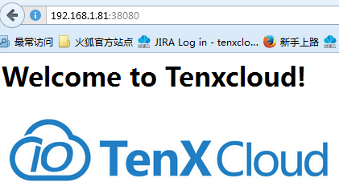

## gitRepo volume 简介

* gitRepo volume会挂载到一个空目录中，并clone一份指定的git代码到该目录中。
* gitRepo volume的生命周期与pod同步。
* clone操作会先于pod创建操作。也就是说pod创建后，代码已在挂载的目录中。

## volume spec 示例

gitRepo volume spec参考[这里](http://kubernetes.io/docs/api-reference/v1/definitions/#v1gitrepovolumesource)

```
volumes:
  - name: git-volume
    gitRepo:
      repository: "git@somewhere:me/my-git-repository.git"
      revision: "22f1d8406d464b0c0874075539c1f2e96c253775"
```

## 使用示例

创建foo.yaml，内容如下：

```
apiVersion: v1
kind: Service
metadata:
  name: foo
spec:
  type: NodePort
  ports:
  - port: 8080
    targetPort: 8080
    nodePort: 38080
  selector: 
    name: foo

---
apiVersion: v1
kind: Pod
metadata:
  name: foo
  labels:
    name: foo
spec:
  containers:
  - image: index.tenxcloud.com/tenxcloud/golang
    name: foo
    command: ["go", "run", "goweb.go"]
    workingDir: "/home/foo/golang-sample"
    volumeMounts:
    - mountPath: /home/foo
      name: git-volume
  volumes:
  - name: git-volume
    gitRepo:
      repository: "https://github.com/tenxcloud/golang-sample.git"
      revision: "master"
```

启动示例：

```
$ kubectl create -f foo.yaml 
You have exposed your service on an external port on all nodes in your
cluster.  If you want to expose this service to the external internet, you may
need to set up firewall rules for the service port(s) (tcp:38080) to serve traffic.

See http://releases.k8s.io/release-1.2/docs/user-guide/services-firewalls.md for more details.
service "foo" created
pod "foo" created
```

该配置文件将创建一个名为foo的pod，并使用一个gitRepo volume。Pod启动后可以在/home/foo目录中看到git仓库https://github.com/tenxcloud/golang-sample.git。
    
command指定了执行“go run goweb.go”，该指令会启动一个简易的web服务（8080端口）。配置文件设置了一个Service，通过NodePort方式将该服务暴露在38080端口。通过浏览器访问k8s集群任意可用节点的38080端口可以访问该服务。
 

## 注意事项

如未在各k8s node中设置私钥，则只能指定HTTPS类型的Repository URL。否则pod创建将失败：

```
Events:
  FirstSeen	LastSeen	Count	From			SubobjectPath	Type		Reason		Message
  ---------	--------	-----	----			-------------	--------	------		-------
  7s		7s		1	{default-scheduler }			Normal		Scheduled	Successfully assigned foo to 192.168.1.82
  <invalid>	<invalid>	1	{kubelet 192.168.1.82}			Warning		FailedMount	Unable to mount volumes for pod "foo_default(25b2583b-1b1a-11e6-8368-005056852444)": failed to exec 'git clone git@github.com:tenxcloud/golang-sample.git': Cloning into 'golang-sample'...
Host key verification failed.
fatal: Could not read from remote repository.

Please make sure you have the correct access rights
and the repository exists.
: exit status 128
  <invalid>	<invalid>	1	{kubelet 192.168.1.82}		Warning	FailedSync	Error syncing pod, skipping: failed to exec 'git clone git@github.com:tenxcloud/golang-sample.git': Cloning into 'golang-sample'...
Host key verification failed.
fatal: Could not read from remote repository.

Please make sure you have the correct access rights
and the repository exists.
: exit status 128
```