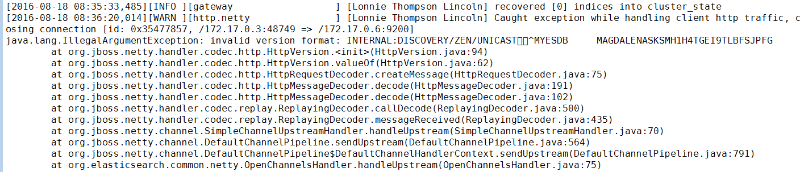

最近研究了如何使用k8s创建一个ES集群，在此与大家分享。

## 概述

我采用的方案参考了k8s官网中的示例，具体参考[这里](https://github.com/kubernetes/kubernetes/tree/release-1.3/examples/elasticsearch/)。该方案是基于quay.io/pires/docker-elasticsearch-kubernetes镜像搭建的集群，该镜像的Dockerfile可在[这里](https://github.com/pires/docker-elasticsearch-kubernetes)找到。其使用了一个第三方的ES插件，专门用来支持在k8s集群中做ES node的服务发现，插件的源码参考[这里](https://github.com/fabric8io/elasticsearch-cloud-kubernetes)，其中使用的k8s client源码参考[这里](https://github.com/fabric8io/kubernetes-client)。

按照readme中的步骤执行即可创建一个简单的ES集群，并可通过k8s的scale功能来弹性伸缩node数量。

这里会遇到第一个坑，scale之后节点未添加成功并在pod日志中会看到以下错误：



问题是由于ES服务发现的请求本应发到9300端口，但却发送到了9200端口。尚不清楚是否是因为ES的插件问题，解决方法很简单，只需要将service拆分成两个（一个对应9200端口，一个对应9300端口），并将rc中定义的环境变量DISCOVERY_SERVICE改为9300对应的service名称即可。

示例中的production_cluster目录中是推荐的用于生产环境的集群编排，将Node分成了Master、Data和Client三种角色。关于ES Node的详细介绍可以查看官方文档中的[Node模块文档](https://www.elastic.co/guide/en/elasticsearch/reference/current/modules-node.html)。简单来讲，Master用来管理index、shard和其他node，多个Master存在时会通过选举机制来确认一个主Master。Data节点用来存储shard并负责数据访问相关的操作。Client节点提供对外访问的接口，类似于一个负载均衡节点。

## 优化

### minimum_master_nodes可配置

discovery.zen.minimum_master_nodes是影响ES集群可用性和一致性的一个很重要的配置。为避免出现脑裂现象，通常Master节点数量应为基数，该配置需要设置为Master数量/2 + 1。一般集群中只需配置为2，并启动3个Master节点即可。

在此方案中，为方便minimum_master_nodes的配置，我们可以修改ES配置文件，使得discovery.zen.minimum_master_nodes可以从环境变量中读取。

* 创建[elasticsearch.yml](attachments/elasticsearch.yml)文件：

```
cluster:
  name: ${CLUSTER_NAME}
node:
  master: ${NODE_MASTER}
  data: ${NODE_DATA}
network.host: ${NETWORK_HOST}
path:
  data: /data/data
  logs: /data/log
  plugins: /elasticsearch/plugins
  work: /data/work
bootstrap.mlockall: true
http:
  enabled: ${HTTP_ENABLE}
  compression: true
  cors:
    enabled: ${HTTP_CORS_ENABLE}
    allow-origin: ${HTTP_CORS_ALLOW_ORIGIN}
cloud:
  kubernetes:
    service: ${DISCOVERY_SERVICE}
    namespace: ${NAMESPACE}
discovery:
  type: kubernetes
  zen:
    minimum_master_nodes: ${MIN_MASTERS} ##通过MIN_MASTERS环境变量控制minimum_master_nodes配置
```

* 创建Dockerfile：

```
FROM quay.io/pires/docker-elasticsearch-kubernetes:2.3.4
 
ADD elasticsearch.yml /elasticsearch/config/
```

通过Dockerfile我们可以创建一个新的镜像，并通过MIN_MASTERS来修改minimum_master_nodes配置。

### 使用kubeconfig配置认证方式

elasticsearch-cloud-kubernetes插件默认使用ca.crt + token的方式认证k8s集群，有时我们可能需要使用其他的认证方式，此时可以通过将kubelet的kubeconfig挂载到容器中实现。

例如：elasticsearch-cloud-kubernetes插件会访问k8s dns的域名，如果我们生成的ca证书的SAN中为指定k8s dns域名，将导致插件访问k8s集群时认证失败，那么ES集群将无法启动。

比较简便的解决方式是直接使用kubelet的kubeconfig中定义的认证方式，kubeconfig文件可以直接挂在到容器中，并通过设置环境变量使得elasticsearch-cloud-kubernetes插件使用kubeconfig定义的认证方式：

* 查看kubelet的–kubeconfig参数确认kubeconfig文件位置，例如为/srv/kubernetes/kubeconfig
* 通过hostPath volume将kubeconfig挂在到容器中：

```
        {
          "kind": "ReplicationController",
          "spec": {
           "template": {
              "spec": {
                ...
                "containers": [{
                  ...
                  "volumeMounts": [
                    ...
                    {
                      "mountPath": "/kubeconfig",
                      "name": "es-kubeconfig"
                    }
                  ]
                }],
                "volumes": [
                  ...
                  {
                    "name": "es-kubeconfig",
                    "hostPath": {
                      "path": "/srv/kubernetes/kubeconfig"
                    }
                  }
                ]
              }
            }
          }
        }
```

* 通过环境变量修改elasticsearch-cloud-kubernetes插件使用的认证方式（别问我怎么知道的，我也想只看文档不看[源码](https://github.com/fabric8io/kubernetes-client/blob/v1.3.83/kubernetes-client/src/main/java/io/fabric8/kubernetes/client/Config.java)的...）：

```
        {
          "kind": "ReplicationController",
          "spec": {
           "template": {
              "spec": {
                ...
                "containers": [{
                  ...
                  "env": [
                    {
                      "name": "KUBERNETES_AUTH_TRYKUBECONFIG",
                      "value": "true"
                    }, {
                      "name": "KUBECONFIG",
                      "value": "/kubeconfig"
                    },
                    ...
                  ]
                }],
                ...
              }
            }
          }
        }
```

* 此处会遇到另外一个坑，在各Node启动的时候会出现异常，错误提示为kubeconfig没有读取权限。这个是因为该镜像使用的java安全策略的配置文件没有对应的权限，为此我们需要修改[java.policy](attachments/java.policy)配置。

```
        ...
            permission java.io.FilePermission "-", "read"; //文件读取权限
        ...
```

* 修改Dockerfile，将新的[java.policy](attachments/java.policy)文件添加到容器目录下：

```
        FROM quay.io/pires/docker-elasticsearch-kubernetes:2.3.4
         
        ADD elasticsearch.yml /elasticsearch/config/
        ADD java.policy /usr/lib/jvm/default-jvm/jre/lib/security/
```

### Master和Data高可用

由于k8s当前版本对于有状态服务的支持并不友好，需要手动为每个Pod单独分配存储卷，管理起来很麻烦。该方案中使用的策略是使用统一路径的hostpath类型存储卷来持久化数据，并使用DaemonSet对象取代RC来编排Master和Data Pod，这样可以保证存储卷设置的简单和统一，又能保证每个Pod的数据不会因为使用相同的存储卷而互相影响。

以Data节点为例，下面是优化的内容：

```
{
  "kind": "DaemonSet", //使用DaemonSet对象
  "spec": {
    "template": {
      "spec": {
        "nodeSelector": { //设置nodeSelector来限制部署的k8s节点
          "kube-system/es-data-node": "true"
        },
        "containers": [
          ...
        ],
        "volumes": [
          ...
          {
            "name": "es-persistent-storage",
            "hostPath": { //使用hostPath类型存储卷
              "path": "/tenxcloud/es_cluster_data/data_node"
            }
          }
        ]
      },
      ...
    },
    "selector": {
      "matchLabels": { //extensions/v1beta1版本API的selector需要设置matchLabels
        "k8s-app": "elasticsearch-logging",
        "role": "data",
        "version": "v1"
      }
    }
  },
  "apiVersion": "extensions/v1beta1", //DaemonSet对应的API
  ...
}
```

其中需要注意的是Master和Data分别设置了nodeSelector，分别为"kube-system/es-master-node":"true"和"kube-system/es-data-node":"true"。这样通过为k8s Node添加对应的标签便可以实现扩容。

## 小结

我们可以通过以上的方案来替换k8s默认使用的ES，可以参考[附件](attachments/prod.zip)中的yaml文件。

使用集群化的ES可以有效提高k8s集群日志的可用性，但并不能解决数据持久性的问题。

由于之前k8s更多的将pod作为无状态对象处理，因此没有很方便的为每个pod提供独立存储卷的方法。在k8s 1.3之后，我们可以结合推出的petset对象来解决，但目前尚处于alpha阶段，不建议在生产环境中使用。
