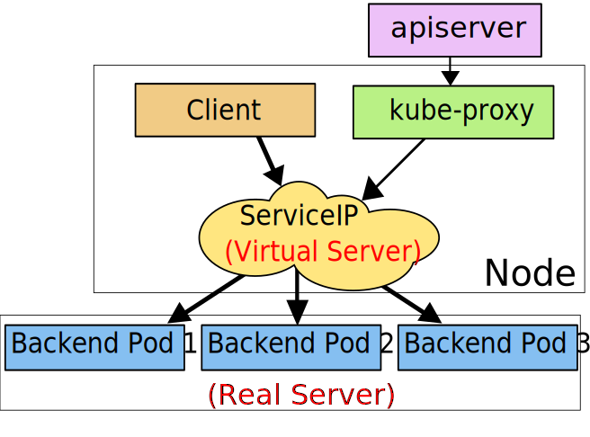

Service是一种抽象，其定义了一个包含pods的逻辑集合以及访问这些pods的策略。

Endpoints会根据service selector动态创建，并根据对应pods的变动实时更新（pod ip）。

如果service为定义selector，则endpoints不会自动创建。此时可以通过手动创建endpoints来指向端点，甚至是集群外的服务端点。

## 服务代理

每个node会运行一个kube-proxy，负责实现service的虚拟IP。

在1.0版本中，service完全在用户空间实现代理，是第四层(TCP/UDP over IP)组件。在1.1版本中，引入了ingress来实现第7层(HTTP)的service，iptables模式的代理也在该版本中引入，1.2版本中成为默认模式。1.8.0-beta.0版本中，引入了ipvs模式代理。

### 代理模式

#### 用户空间模式

kube-proxy为每个service在node上打开一个port，并设置iptables规则，从而捕获访问service clusterIP和port的数据并转发到代理port。


#### iptables模式

kube-proxy为每个service设置iptables规则，来捕获访问service clusterIP和port的数据来转发。为每个endpoint设置iptables规则来选择pod。

iptables模式不需要在用户空间和内核空间来回切换，会比用户空间模式更快更可靠。然而该模式不能在pod未响应的情况下使用其他pod重试，因此会依赖readiness probe的设置。


#### ipvs模式

kube-proxy调用netlink接口创建ipvs规则并根据service和endpoint状态周期性更新规则。除了拥有更好的性能外，还提供了更多的lb算法：
* rr: round-robin
* lc: least connection
* dh: destination hashing
* sh: source hashing
* sed: shortest expected delay
* nq: never queue

该模式需要node上预先安装IPVS内核模块，如果未安装，则使用iptables模式。



## 发现service

可使用两种方式发现service：
* DNS，使用DNS集群插件，可通过service名称和namespace来访问service。
* 环境变量。如redis-master service暴露了tcp端口6379，并分配了cluster ip 10.0.0.11，可通过以下环境变量访问service：

```
REDIS_MASTER_SERVICE_HOST=10.0.0.11
REDIS_MASTER_SERVICE_PORT=6379
REDIS_MASTER_PORT=tcp://10.0.0.11:6379
REDIS_MASTER_PORT_6379_TCP=tcp://10.0.0.11:6379
REDIS_MASTER_PORT_6379_TCP_PROTO=tcp
REDIS_MASTER_PORT_6379_TCP_PORT=6379
REDIS_MASTER_PORT_6379_TCP_ADDR=10.0.0.11
```

## Headless service

当不需要service ip或想定制lb策略时，可创建headless service（.spec.clusterIP指定为None）。

cluster ip不会分配给headless service，kube-proxy也不会处理这些service，因此lb和代理均不会生效。

DNS会对headless service做如下处理：
* 如果设置了selector，则监视对应的endpoint，从而创建直接指向pods的A记录。
* 如果未设置selector，则：
  * 为ExternalName类型的service创建CNAME记录
  * 根据同名的endpoint创建A记录。

## service类型

* ClusterIP。默认模式。
* NodePort。在每个Node上的指定端口上暴露service，可通过node ip和暴露的端口访问service。
* LoadBalancer。使用云服务商的lb暴露service。
* ExternalName。将service与指定的name进行映射，DNS会创建CNAME记录。该类型需要1.7及以上版本的kube-dns插件。

